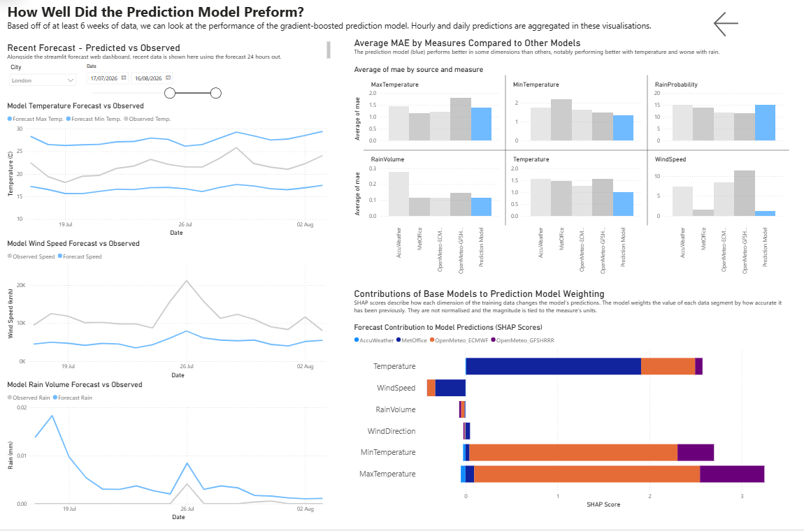

# WeatherAggregator - How accurate are UK weather forecasts, and can they be improved?

### Contents

- Overview
- Architecture
- Results
  - Summary
  - Issues
- Tech Stack
- Repo Map
- AI Collaboration
- Local Run Instructions

## Overview

This project aims to quantify the accuracy of 4 major weather forecasting models, and from these learnings construct a machine learning model which can adjust for errors, producing an overall more robust forecast than any source on its own. 


**Data Collection / ETL:**

- 6 dimensions covered: Max. Temp., Min. Temp, Rain Volume, Rain Probability, Wind Speed, Wind Direction
- 10 UK cities covered: London, Manchester, Birmingham, Leeds, Norwich, Bristol, Cardiff, Glasgow, Aberdeen, Newcastle
- Forecast APIs called and maximum horizon forecast pulled at hourly/daily intervals
- Observation data taken from MetOffice for the previous hour in each city
- Run hourly, hosted on Railway, stored in 3 (hourly/daily/observations) tables in PostgreSQL database

**Model Training:**

- Data transformed to pair old forecast with observation data for that time
- Gradient Boosted Tree model trained on following features: dimensions mentioned above, city, hours/days ahead to forecast, lag features (last 1-3 days of weather from date of forecast), weighted features from recent model performance
- This is used to predict the 48 hour and 14 day forecast, also stored in the database

**Data Analysis:**

- Forecast source performance is transformed into long, tidy format and exported daily to Tableau
- Mean Absolute Error (MAE) and Bias are calculated
- Model performance is assessed with MAE, Bias, Brier scores, and compared to single sources - Not yet implemented. Model needs time to train.
- Model predictions are exported to streamlit user-friendly weather dashboard

The data sources were chosen for their use by major weather apps/websites:

| Model             | Used by         | Daily Horizon  | Hourly Horizon |
|:-----------------:|:---------------:|:--------------:|:--------------:|
| MetOffice         | BBC, Sky        | 14 Days        | 48 Hours       |
| AccuWeather       | ABC, Bloomberg  | 5 Days         | 12 Hours       |
| OpenMeteo-ECMWF   | Apple           | 14 Days        | 48 Hours       |
| OpenMeteo-GFSHRRR | Google          | 14 Days        | 48 Hours       |

Forecasts are compared against observation data from the MetOffice. MetOffice forecasts are expected to outperform other models due to the locality factor - The MetOffice has weather stations all across the UK which can produce accurate local forecasts, whereas other sources use global weather data to create lower resolution forecasts. Major cities have been chosen as target locations, which employ aggregate forecasting already to assist this imbalance. Rainfall volume is not covered by the MetOffice API, so DEFRA, SEPA, and the Natural Resources Wales API have been used. 8 total API endpoints are called in the collection phase.

Presently, this project is limited by API and cloud hosting costs. Upgraded subscriptions could offer longer forecasts and more city coverage. However, this creates plenty of room for easy expansion with more forecast models, more cities, more weather dimensions and a greater historic dataset. 

## Results

Ensemble LightGBM model predictions can be viewed in this Streamlit app [here!](https://streamlit-production-6256.up.railway.app/)

Source data quality is visualised in this [Tableau dashboard](https://public.tableau.com/views/WeatherAggregator/Dashboard1?:language=en-GB&:sid=&:redirect=auth&:display_count=n&:origin=viz_share_link).



## Architecture

T

```
APIs (MetOffice / OpenMeteo / AccuWeather / DEFRA / NRW / SEPA)
    │
    │  hourly at :01          
    ▼                        |------------------------|   
weather_api_export.py ──────►|  PostgreSQL DB         | ◄─── reads ── app.py ──► Streamlit web dashboard
                             |  ├── observations      |           
                             |  ├── hourly_forecast   |            
                        |──► |  ├── daily_forecast    | ◄─── reads (Hourly, retained for 365 days)
                        │    |  └── ensemble_forecast |        |
                        │    |------------------------|        │
                      reads             ▲                  tableau_export.py
                        │               │ (hourly :05)         │ 
                        │      predict_ensemble.py             ▼
                        │               ▲                   sheets_export.py ──► Google Sheet ──► Tableau dashboard
                        │               │ models.pkl                                     
                        │               │ (daily 03:01)
                        │-------train_ensemble.py ──► metrics.json
```
### Summary
 
** SOURCES **

- Rain probability cant use rain
- 


** MODEL **

- Needs more time
- Offer summary

### Issues

- Defra rain issue which called forecasts from a month ago
- Broken weather stations with crazt values
- MetOffice overwrote every model, hence short data at TOW
- Accuweather is ass (look at MAE)
- Rain is overpredicted due to binary validation


## Tech Stack

- **Languages:** Python 3.12+, SQL (PostgreSQL dialect)
- **Database:** PostgreSQL on Railway, SQLAlchemy 2.x
- **ML:** LightGBM (quantile + binary classifier heads), scikit-learn, SHAP, conformal calibration
- **Data:** pandas, NumPy
- **Web / dashboards:** Streamlit (Plotly), Tableau Public
- **External APIs:** Met Office DataHub, Open-Meteo, AccuWeather, DEFRA/NRW/SEPA rainfall
- **Auth / integrations:** OAuth2 (gspread), google-auth for the Sheets feed
- **Scheduling:** `schedule` library on a Railway worker process
- **Deployment:** Railway (web + worker), Procfile-defined

## Repo Map

**Pipeline**
- `weather_api_export.py` — hourly ETL from 4 forecast APIs + 3 rainfall APIs, writes to Postgres
- `train_ensemble.py` — daily LightGBM training run (~6 min), writes `models.pkl` + `metrics.json`
- `predict_ensemble.py` — hourly prediction cycle, writes to `ensemble_forecast`
- `cron.py` — schedule driver, runs the three jobs above

**Surfaces**
- `app.py` — Streamlit dashboard (the `web:` process on Railway)
- `tableau_export.py` — long-format DataFrame for the Tableau Sheet feed
- `sheets_export.py` — pushes 4 tabs to the Google Sheet (OAuth2 user creds)

**Shared**
- `ensemble_lib.py` — feature engineering shared between train + predict + app
- `locations.json` — 10 UK cities with lat/lon, AccuWeather keys, rainfall station IDs

**One-off scripts (kept for audit trail)**
- `db_migrate.py`, `db_fix_*.py`, `db_backfill_*.py` — schema migrations + the historical fixes from the data-quality section above
- `model_quality_audit.py` — read-only diagnostic that flagged the Daily over-fit

## AI Collaboration

Claude Code was used to construct the ML portion of this project, including train_ensemble.py, predict_ensemble.py, the streamlit dashboard, and the functions in sheets_export concerning ensemble data. It also wrote the scripts involved in the Google Sheets --> Tableau data feed, as Tableau desktop does not support Railway-hosted Postgres as a data source.

AI tools were also used in the planning and debugging of this project, as well as in-line suggestions for boilerplate code.

All code was audited and checked at each stage for unexpected results. Several issues were present, as detailed in the Results section. Planning & architecture design, cloud hosting, data analysis, collection scripts and transformations did not involve AI authorship.

## Local Run Instructions


You need:
- Python 3.12+
- PostgreSQL database (local or Railway-hosted)
- API keys, and subscriptions where applicable, for Met Office DataHub, AccuWeather, and the Welsh NRW rainfall API
- (Optional) Google OAuth credentials if you want the Sheets feed

### Setup

```bash
git clone https://github.com/<you>/WeatherAggregator
cd WeatherAggregator
pip install -r requirements.txt
cp .env.example .env   # then fill in DATABASE_URL + API keys
python db_migrate.py   # creates tables and indexes
```
One-off data pull
```bash
python weather_api_export.py
```
This populates observations, hourly_forecast, and daily_forecast for the 10 cities in locations.json. Run hourly.

Train + predict
```bash
python train_ensemble.py    # ~6 min, needs >= 7 days of history
python predict_ensemble.py  # appends to ensemble_forecast
```

Streamlit dashboard

```bash
streamlit run app.py
```

Open http://localhost:8501. The dashboard expects at least one predict_ensemble cycle to have run.

Cron loop (mirrors Railway worker)

```bash
python cron.py
```
Runs hourly export + predict at :01/:05, daily train at 03:01. On boot it will retrain if models.pkl is missing or older than 26 hours